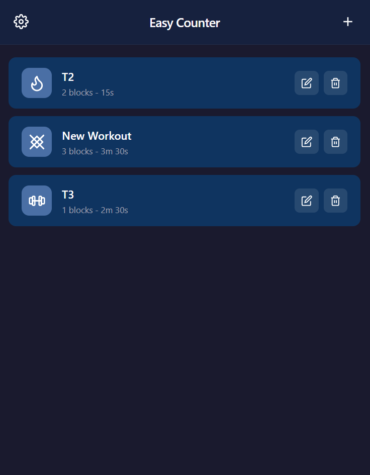
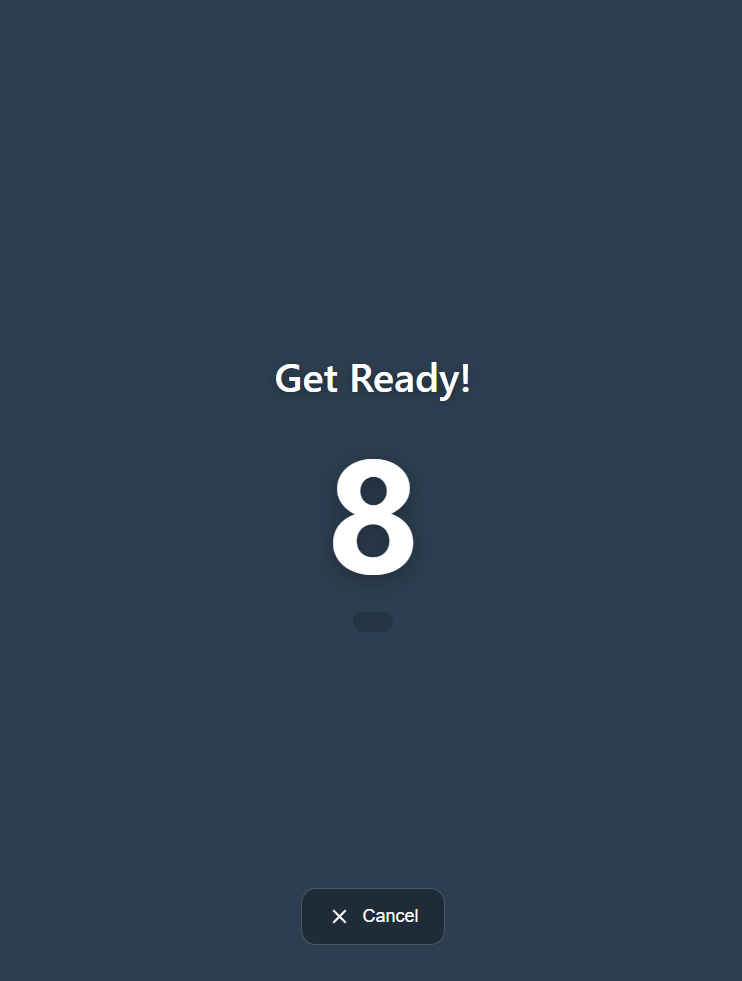

# Easy Counter - Workout App

Easy Counter is a lightweight browser-based workout timer that lets you build custom workout flows from reusable blocks, then run them with clear visual and audio cues.

## Screenshots

### Main page

### Workout execution

## Features

### Workout management
- Create, edit, and delete workouts.
- View workouts as cards with icon, block count, and estimated total duration.
- Start a workout directly from the main list.

### Workout editor
- Set a custom workout name.
- Choose an icon for each workout.
- Build a reusable block library inside each workout.

### Block configuration
- Configure block name and color.
- Choose timer mode per block:
  - **Timer**: block runs for a fixed duration.
  - **On Click**: block waits for user input to continue.
- Set duration (in seconds) for timed blocks.

### Timeline builder
- Add blocks to a workout timeline.
- Add loop groups with configurable repetitions.
- Add blocks inside loops.
- Mark loop items as **Skip last** to skip them on the final loop iteration.
- Reorder timeline items with drag and drop.
- Remove blocks or loops from the timeline.

### Workout execution
- 10-second "Get Ready" countdown before start.
- Full-screen workout display with:
  - current block name,
  - timer (or infinity symbol for click-based blocks),
  - loop progress information.
- Tap-to-continue support for click-based blocks.
- Cancel flow with confirmation modal.
- Completion screen shown at the end.

### Audio feedback
- Countdown beeps during the initial countdown.
- Start beep when entering a new block.
- End-of-block warning beeps during the last seconds of timed blocks.
- Final completion beep sequence.

### App options
- Theme selection (Blue, Green, Red).
- Configurable end-of-block beep window (1 to 99 seconds).

### Data persistence and portability
- Workouts and settings are stored in `localStorage`.
- Export workouts to JSON.
- Import workouts from JSON with two modes:
  - **Replace All**
  - **Add to Existing**

## Technical notes
- Built with plain HTML, CSS, and JavaScript.
- No backend required.
- Runs fully in the browser.

## Run locally
1. Open `index.html` in a modern browser.
2. Create your first workout with the `+` button.
